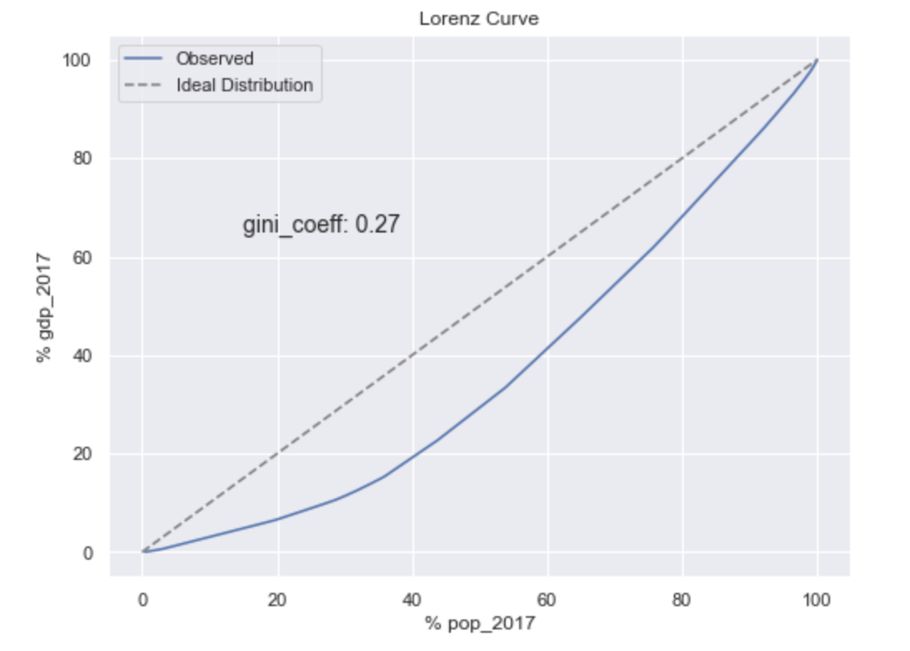

# lorenz_plot_function
This notebook provides code for a function that plots a lorenz curve from a pandas dataframe and calculates the gini inequality coefficient. Lorenz curves are a method to visualize inequality distributions. Typically they are used in the field of economics. For more info please refer to https://en.wikipedia.org/wiki/Lorenz_curve.
Follow the steps in the notebook to plot your own lorenz curve. Data must come from a pandas dataframe and all NaN values must be removed or filled.
Plots should look something like this:

